# 🩺 Network Doctor

**Network Doctor** is a modern Windows network diagnostics and troubleshooting application built with **Flutter**.

It brings essential network monitoring, diagnostic, discovery, and analysis tools together in one desktop application.

> 🚧 **Status: Active Development**

---

## 📸 Screenshots

### Dashboard

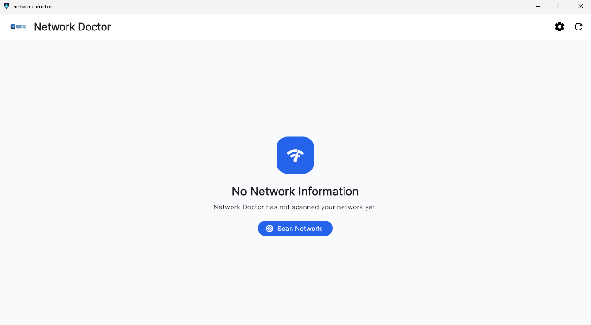

### Network Health

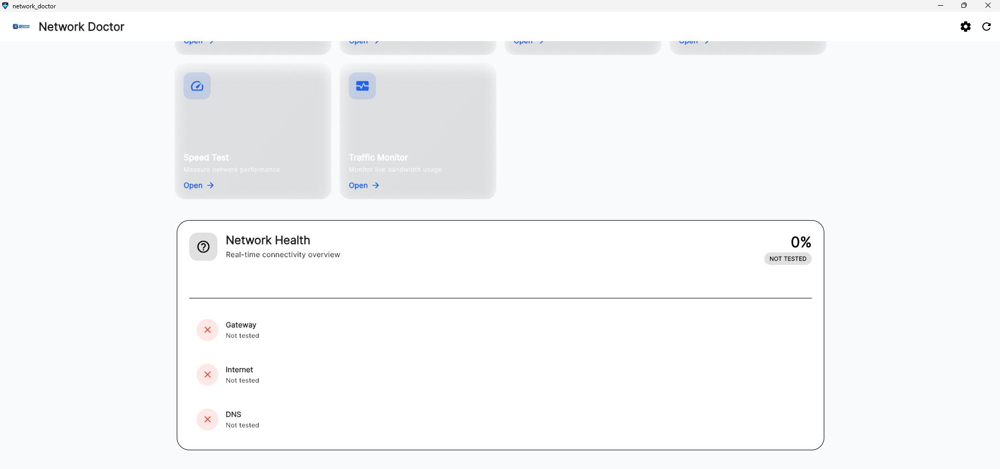

### Network Information

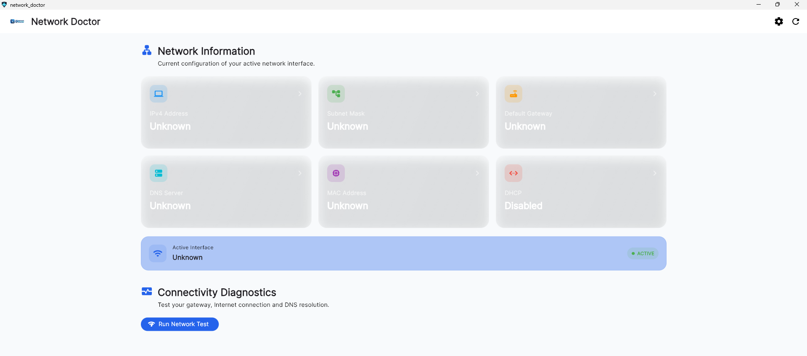

### Network Diagnostics

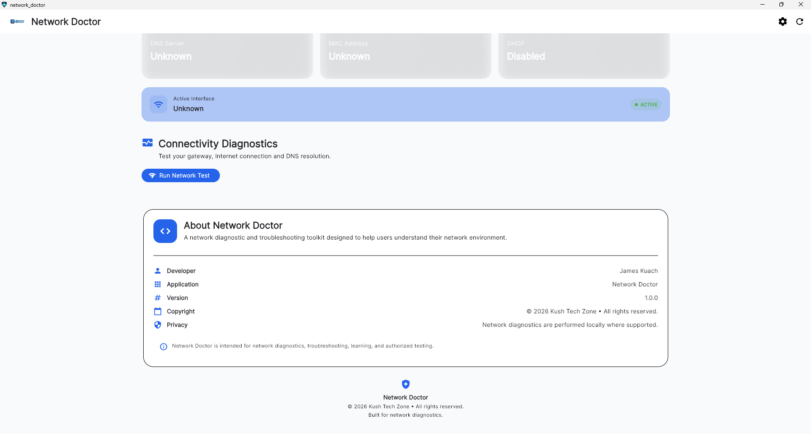

### Network Tools

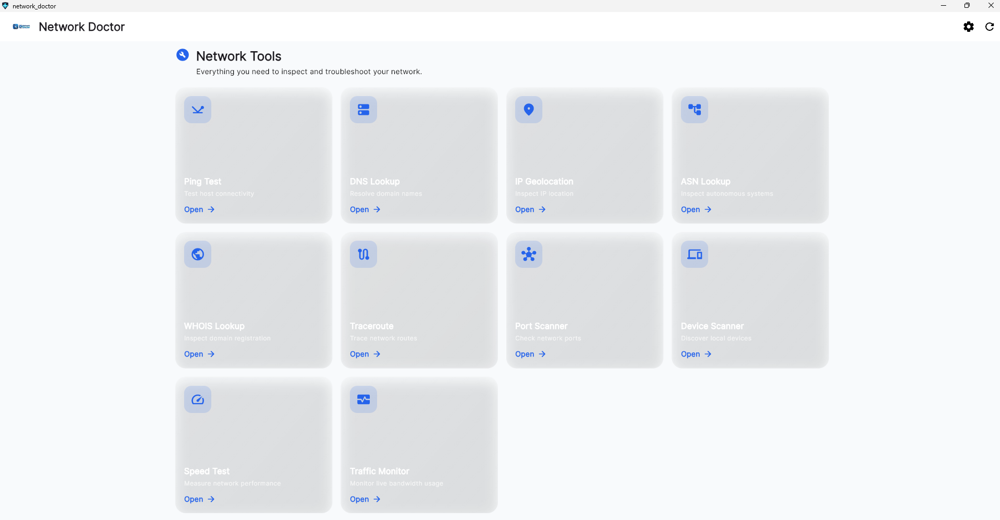

---

## 🧰 Network Tools

### 📡 Ping Test

Test connectivity and latency to network hosts.

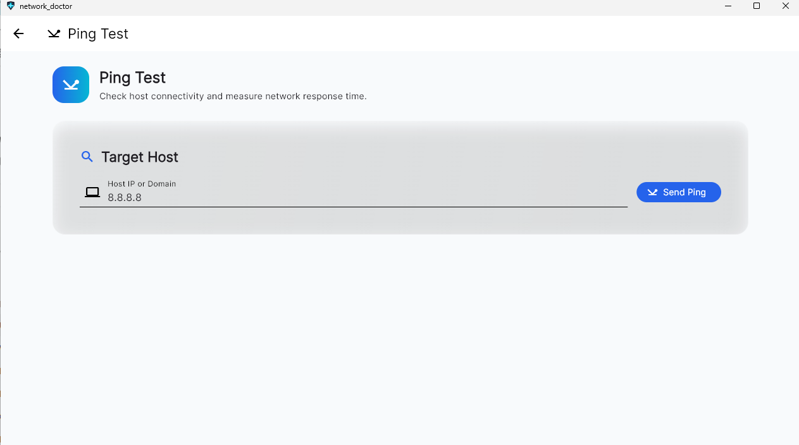

---

### 🔎 DNS Lookup

Investigate DNS resolution and domain information.

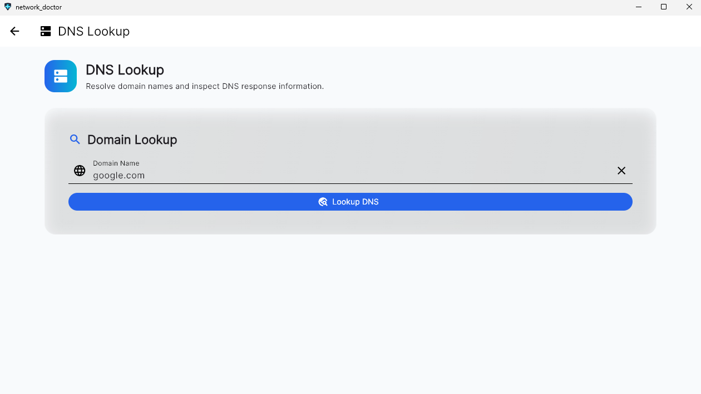

---

### 🛣️ Traceroute

Trace the network path between your computer and a destination.

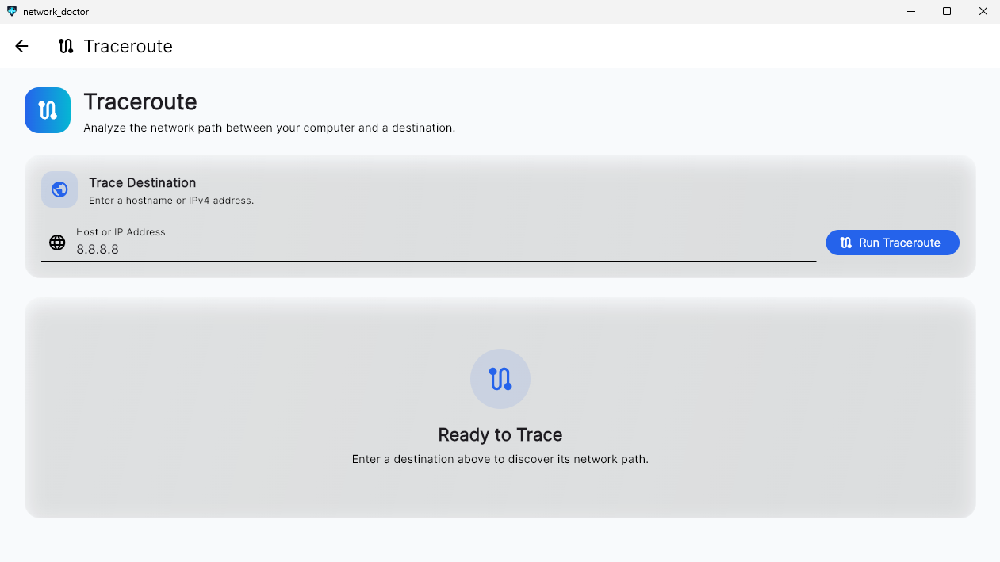

---

### 🔌 Port Scanner

Check whether network ports are reachable on a target host.

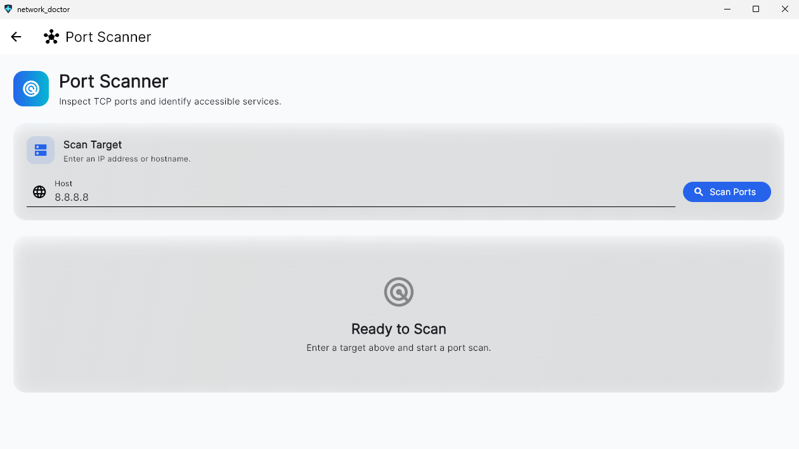

> ⚠️ Only scan systems and networks that you own or have permission to test.

---

### 🖥️ Device Scanner

Discover devices on the local network.

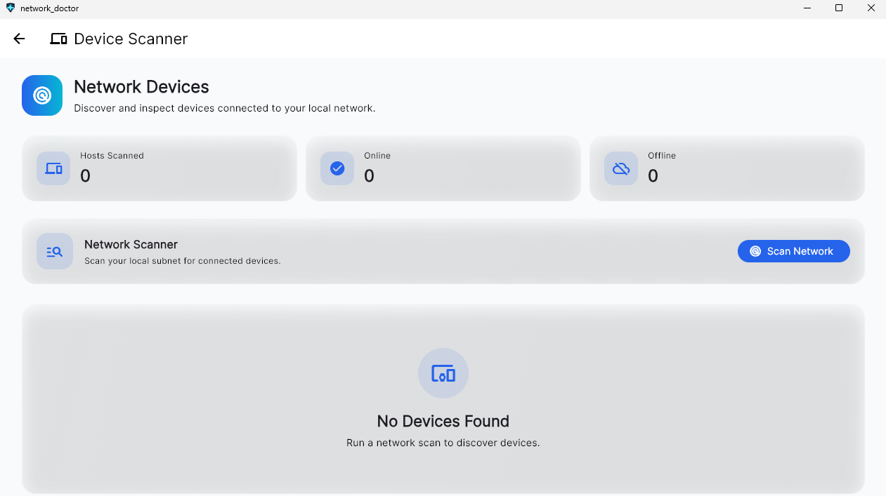

---

### 🚀 Speed Test

Test network connection performance.

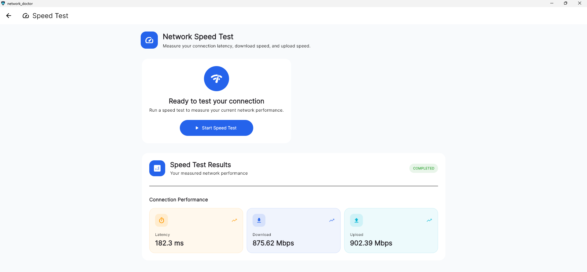

---

### 📊 Traffic Monitor

Monitor network traffic and activity.

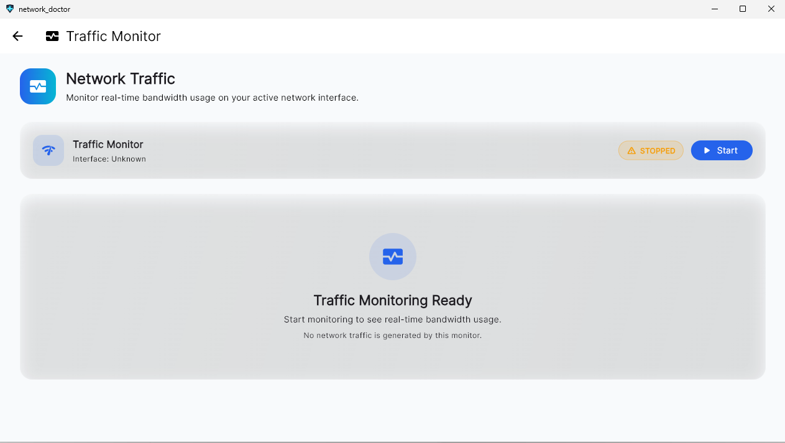

---

## 🌐 Network Information

Network Doctor can display:

* Network interface
* IPv4 address
* Subnet mask
* Default gateway
* DNS server
* MAC address
* DHCP status
* Ethernet information
* Wi-Fi information

---

## 🩺 Connectivity Diagnostics

Network Doctor can perform automated connectivity checks including:

* Default gateway connectivity
* Internet connectivity
* DNS functionality
* Network health
* Basic connectivity status

The diagnostic process helps identify where a connection problem may be occurring:

```text
Computer
   │
   ▼
Network Adapter
   │
   ▼
Default Gateway
   │
   ▼
Internet
   │
   ▼
DNS
```

---

## 🌍 Additional Network Analysis

Network Doctor also includes tools for:

### WHOIS Lookup

Investigate domain registration and related information.

### IP Geolocation

Retrieve geographic and network information associated with an IP address.

### ASN Lookup

Investigate Autonomous System information associated with an IP address or network.

---

## ⚙️ Features

| Feature                | Description                           |
| ---------------------- | ------------------------------------- |
| 🌐 Network Information | View local network configuration      |
| 🩺 Network Diagnostics | Diagnose connectivity problems        |
| 📡 Ping                | Test connectivity and latency         |
| 🔎 DNS Lookup          | Investigate DNS resolution            |
| 🛣️ Traceroute         | Analyze network paths                 |
| 🔌 Port Scanner        | Check network ports                   |
| 🖥️ Device Scanner     | Discover local devices                |
| 🚀 Speed Test          | Test connection performance           |
| 📊 Traffic Monitor     | Monitor network traffic               |
| 🌍 IP Geolocation      | Investigate IP geographic information |
| 🏢 ASN Lookup          | Investigate autonomous systems        |
| 🔍 WHOIS Lookup        | Investigate domain information        |

---

## 🖥️ Platform

Network Doctor currently targets:

**Windows Desktop**

Support for additional platforms may be considered in future versions.

---

## 🛠️ Technology Stack

Network Doctor is built using:

* **Flutter**
* **Dart**
* **Provider**
* **Windows Desktop**
* REST/RDAP-based network services
* Windows networking utilities

---

## 🏗️ Architecture

The application uses a modular architecture separating UI, state management, models, and network services.

```text
lib/
├── models/
├── providers/
├── screens/
│   └── tools/
├── services/
├── theme/
├── widgets/
└── main.dart
```

### Models

The project includes models such as:

```text
NetworkInfo
PingResult
DnsResult
TracerouteResult
PortScanResult
NetworkDevice
SpeedTestResult
TrafficStats
WhoisResult
IpGeolocationResult
AsnResult
Diagnosis
```

### Services

Network operations are separated into dedicated services:

```text
WindowsNetworkService
PingService
DnsService
TracerouteService
PortScannerService
NetworkScannerService
DeviceScannerService
SpeedTestService
TrafficMonitorService
WhoisService
IpGeolocationService
AsnService
DiagnosticService
```

---

## 📁 Project Structure

```text
network-doctor/
│
├── assets/
│   └── images/
│
├── installer/
│   ├── NetworkDoctor.iss
│   ├── after_installation.txt
│   ├── information.txt
│   └── license.txt
│
├── screenshots/
│   ├── dashboard.png
│   ├── network_health.png
│   ├── network_info.png
│   ├── network_diagnostic.png
│   ├── network_tools.png
│   ├── ping_test.png
│   ├── DNSLOOK.png
│   ├── traceroute.png
│   ├── Port_scanner.png
│   ├── device_scanner.png
│   ├── speed_test.png
│   ├── network_traffic.png
│   └── app_settings.png
│
├── lib/
├── test/
├── windows/
├── pubspec.yaml
├── pubspec.lock
├── README.md
└── .gitignore
```

---

## 🚀 Getting Started

### Requirements

Before building Network Doctor, install:

* Windows 10 or later
* Flutter SDK
* Dart SDK
* Visual Studio
* Visual Studio Windows Desktop development tools
* Git

Check your Flutter installation:

```powershell
flutter doctor
```

Check available devices:

```powershell
flutter devices
```

---

## 📥 Clone the Repository

```powershell
git clone https://github.com/KTZ56/network-doctor.git
```

Enter the project:

```powershell
cd network-doctor
```

---

## 📦 Install Dependencies

```powershell
flutter pub get
```

---

## ▶️ Run Network Doctor

```powershell
flutter run -d windows
```

---

## 🏗️ Build for Windows

Create a release build:

```powershell
flutter build windows --release
```

The application will be generated under:

```text
build\windows\x64\runner\Release\
```

---

## 📦 Windows Installer

The project includes an **Inno Setup** configuration:

```text
installer/NetworkDoctor.iss
```

Open the file with Inno Setup to generate the Windows installer.

Future releases will provide downloadable installers through the GitHub Releases page.

---

## 🧪 Development

Run static analysis:

```powershell
flutter analyze
```

Run tests:

```powershell
flutter test
```

Format the source code:

```powershell
dart format lib test
```

---

## 🔄 Updating the Project

Get the latest changes:

```powershell
git pull
```

After making changes:

```powershell
git add .
git commit -m "Describe your changes"
git push
```

---

## 🔐 Security & Responsible Use

Network Doctor contains tools capable of interacting with network hosts and services.

Features such as:

* Port scanning
* Device discovery
* Network scanning
* WHOIS/RDAP lookups

should only be used on systems and networks where you have authorization.

Do not use Network Doctor to:

* Access systems without permission
* Scan unauthorized networks
* Disrupt network services
* Circumvent security controls
* Perform unauthorized security testing

Network Doctor is intended for legitimate:

* Network administration
* IT troubleshooting
* Education
* Network analysis
* Authorized security testing

---

## 🗺️ Roadmap

* [ ] Advanced network diagnostics
* [ ] Improved network health scoring
* [ ] Better Wi-Fi information
* [ ] Advanced device discovery
* [ ] Network history
* [ ] Diagnostic report export
* [ ] PDF/HTML reports
* [ ] Advanced DNS analysis
* [ ] Improved traffic monitoring
* [ ] Automatic troubleshooting recommendations
* [ ] GitHub Actions automated builds
* [ ] GitHub Releases
* [ ] Additional platform support

---

## 🤝 Contributing

Contributions, bug reports, suggestions, and feature requests are welcome.

Create a feature branch:

```powershell
git checkout -b feature/my-feature
```

Make your changes, then run:

```powershell
flutter analyze
flutter test
```

Commit:

```powershell
git add .
git commit -m "Add my feature"
```

Push:

```powershell
git push origin feature/my-feature
```

Then open a Pull Request on GitHub.

---

## 🐛 Reporting Issues

When reporting an issue, include:

* Windows version
* Network connection type
* Network Doctor version
* Steps to reproduce
* Expected behavior
* Actual behavior
* Error messages
* Screenshots where applicable

---

## 📄 License

Network Doctor is currently under active development.

An open-source license will be added before the first official open-source release.

---

## 👨‍💻 Author

**James Jok**

GitHub:
https://github.com/KTZ56

---

## ⭐ Support Network Doctor

If you find Network Doctor useful:

⭐ Star the repository
🐛 Report bugs
💡 Suggest features
🔧 Contribute improvements
📢 Share the project

---

## 📌 Project Status

Network Doctor is an actively developing Windows network diagnostics and troubleshooting application.

The goal is to provide a practical, modern, and accessible toolkit for understanding, monitoring, diagnosing, and troubleshooting computer networks from a single desktop application.

---

### 🩺 Network Doctor

**Diagnose. Analyze. Understand your Network.** 🌐
